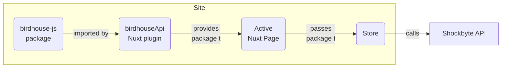
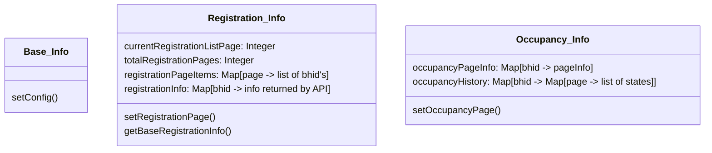

# Shockbyte BirdHouses Admin Panel

This dashboard shows the status of all birdhouses using the innovative Smart BirdHouse technology.

We've got sections about the [Project Design](#project-design) (nice descriptions of how this is organised) and the [Project Log](#project-log) (stream-of-consciousness thoughts while developing this).

## Environment variables

You can configure the dashboard through these environment variables:

- `NUXT_PUBLIC_API_BASE`: Base API URL, e.g. `https://example.com`
- `NUXT_PUBLIC_REGISTRATION_ITEMS_PER_PAGE`: Number of items to display on the birdhouses list.
- `NUXT_PUBLIC_LOAD_OCCUPANCY_DETAILS_ON_LIST`: If set to `false`, don't load occupancy details on birdhouses list. Since each birdhouse requires a separate API call to retrieve this details, it can improve loading times.
- `NUXT_PUBLIC_OCCUPANCY_STATES_PER_PAGE`: Number of occupancy states to get from API on each specific birdhouse page.

## Docker quick start

You can get the dashboard up and running quickly by using Docker!

### Docker compose

You can use the default [docker compose file](./compose.yaml) with this command:

```bash
docker compose up
```

Change the environment variable `NUXT_PUBLIC_API_BASE` to point towards the real API, run the command, then access the dashboard on port 3000. If running the command locally, at http://localhost:3000

### Docker

You can run the prebuilt docker image with this command:

```bash
docker run -it -e NUXT_PUBLIC_API_BASE=https://example.com -p 3000:3000 ghcr.io/danieloaks/shockbyte-birdhouse-admin:release
```

Just replace `https://example.com` with the real API you want to use, then access the dashboard on port 3000. If running the command locally, at http://localhost:3000

## Development

If you want to get started developing the app, you can use the below commands.

### Setup

Make sure to install the dependencies:

```bash
asdf install  # sets up the right version of nodejs
yarn install
```

### Development Server

Start the development server on http://localhost:3000

```bash
yarn dev
```

### Production

Build the application for production:

```bash
yarn build
```

Locally preview production build:

```bash
yarn preview
```

Start production build:

```bash
yarn start
```

Check out the [Nuxt deployment documentation](https://nuxt.com/docs/getting-started/deployment) for more information.

## Project design

This is a pretty standard Nuxt application, using Pinia and Tailwind!

The main interesting elements are the store which holds our state data, and how we communicate with the API. Below we'll describe how each works.

### The API

Here's how API communication is handled in the app:

---



---

Basically, We interact with the BirdHouse API via the [`@danieloaks/codingtest-birdhouse-js` package](https://github.com/DanielOaks/codingtest-birdhouse-js), and that library takes a lot of inspiration from Shockbyte's existing [`whmcs-node` package](https://github.com/Shockbyte/whmcs-node).

This library is exposed via the [birdhouseApi Nuxt plugin](./plugins/birdhouseApi.client.ts), available client-side only.

This finally gets passed to the [birdhouse store](./stores/birdhouses.ts) by the caller, every time a method that calls the API is performed. It's done this way because Pinia stores can't access the config on setup very easily, and this seems like a usable solution for now.

### The Store

The [birdhouse store](./stores/birdhouses.ts) holds all state data that's used by the app. This state data includes the registrations and occupancy info, and is held for the life of the app. We intentionally don't persist any state data to `localStorage`, as we want to grab the most up-to-date data each time the page is reloaded.

The store will call the BirdHouse API as needed to backfill data, based on calls from the pages.

Here's how the elements in this store are logically setup:



### Desired API changes

This app isn't as nice as it could be, and I'd request a few API changes to improve this.

- `GET /registration` and `GET /registration/{ubid}`: Return the current occupancy details on these API responses. Since the dashboard must display these values, and they aren't provided currently, we need an extra API call for every single displayed registration entry that has a birdhouse.
- `GET /house/{ubid}/occupancy`: Rather than paginating based on pages, it may make sense to update the design to use some kind of date selector and paginate based on entered dates? This could improve how we display the graph (see [issue #5](https://github.com/DanielOaks/codingtest-birdhouse-admin/issues/5) for more details). It may also be worth checking the app/s that add data here, since we've seen a number of instances where the same timestamp and occupancy figures are recorded multiple times, with different occupancy state IDs.

## Project log

This section outlines my thoughts while developing this project. It should give insight into my development progress and thoughts.

---

On first look this seems to be a pretty simple dashboard, with easy-to-follow designs and an API that suits this use case. My initial thoughts are to create a fairly standard Nuxt site with three pages – Landing, List of birdhouses, and Single birdhouse.

I've put together [This MVP issue](https://github.com/DanielOaks/codingtest-birdhouse-admin/issues/1) which outlines all the features this site **must** contain. And this [Map mode issue](https://github.com/DanielOaks/codingtest-birdhouse-admin/issues/2) describing a fancy 'map display' that I think would really suit this project once I've got the base functionality.

---

I've created the Nuxt base and landing page, and now I'm thinking about how and when to load the data from the API. I might make a separate JS module that only handles comms with the API, that makes sense.

There's also an issue around the navbar in the footer. It could paginate just the list of birdhouses, but could also paginate different elements on each page (e.g. on the Birdhouse Overview tab it paginates the dates, on the Graph tab it paginates the time). The footer stretches underneath the sidebar+wrapper, and it doesn't make a lot of sense for it to be there if it paginates different elements inside the content box – normally I'd want to clarify this with design. I'll tackle this element a bit later and see what makes the most sense.

---

Importing the icons has been a bit annoying. I've ended up with [nuxt-svgo](https://nuxt.com/modules/nuxt-svgo) to handle loading svgs as inline elements, as it's by far the easiest way to get things up and running.

---

Having more of a think about the pagination in the footer, there's not any reason to include it on the birdhouse overview page unless it does paginate days and the like there as well. For now I'm going to have it be an element of the main content bit, and have the sidebar take up the entire left of the screen instead.

---

Alrighty, I've now got a very basic js lib ready, which is being made accessible via the birdhouseApi Nuxt plugin here. I'm a bit unsure of how to best integrate Pinia stores into the site, since with the pagination arbitrary pages can be grabbed... Perhaps I could store everything as a map/dict where the key is the page number and the value are the list of entries on that page, but that feels a bit naïve. I'm gonna do some sketches to see if I can work out how I want this to function.

After some sketching I've come to this as a rough layout:

- Birdhouses: Map, each page to a list of UBIDs.
- BhRegistration: Map, each UBID to the reg info (birdhouse if it exists).
- BhOccupancy: Map, each UBID to a map of paginated occupancy details.

I've asked for feedback on the footer pagination item, to see if we are paginating the occupancy details or not. If we are, the above would work!

---

So the footer on the single birdhouse page does paginate the occupancy numbers, hmm. I can make this work, but it may be a bit strange using it on the overview vs on the graph.

On the upside, we are now successfully grabbing occupancy data on the list page. However, it does add a lot of waiting (I'm guessing the API isn't hosted in Australia). Because of that I've had to add a loading modal, and I've also added a way to disable those extra API calls via an environment variable. Ideally we'd be returning the current occupancy figures in the registration API response. With this I think the list page is now feature complete, hooray!

It is time to do a decent cleanup though. Things are a bit messy, especially in the Birdhouses store. I'll try to do that, and allow paginating the occupancy details (right now it's a simple list and doesn't take paging into account), before diving into any other tasks.

---

The refactoring went well and the store is now a lot more understandable, usable, and requires a lot less functions than it previously did.

Now when you go between pages on the birdhouses list, it reflects this in the URL with a query variable. The final bit of site navigation work to do is to ensure that the birdhouse overview pagination does the same thing, and then I can call that section done.

I've also added a decent bit of documentation now, which is nice, and setup the whole docker + docker-compose part. Had to use multi-stage images because without doing so the final image was way larger than it should've been (I could potentially reduce the size further by only copying the `.output` folder to the final server, I'll try that if I have space to do so).

Now I'm onto describing the project design and adding docs for the typescript lib that calls the API, hooray!
